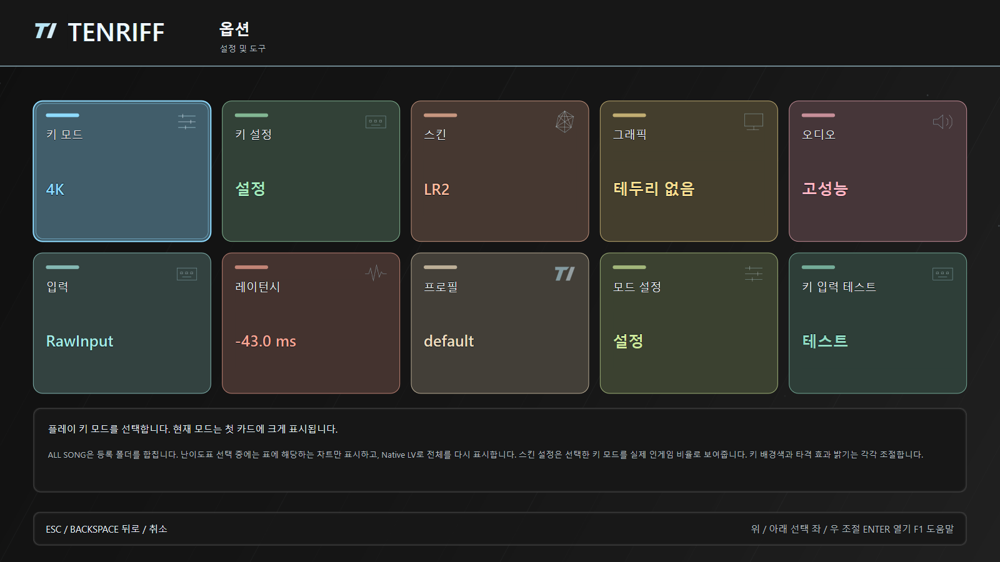

# TenRiff 1.8.0 — settings, skins and play controls

2026-10-02. This release combines the settings and gameplay presentation changes since 1.7.10.

## Changes and rationale

- Give every Options category a pastel accent on its card background, border and value. The black/white menu base stays neutral; stronger contrast and an inset outline identify the selected card independently of hue. Ten named `native.colors.options.*` slots are editable in the skin editor.
- Support 1600×900, 1366×768, 16:10, ultrawide and monitor-provided resolutions. Render Skin Settings through the actual gameplay path at a uniform scale so field size, positions and proportions agree with play and ghost battle.
- Group related settings, fix overlapping mouse minus/plus regions, expose mouse controls and repeat enabled minus/plus settings while holding Left/Right. Use stable setting IDs so reordering does not change the action. Add ALL SONG/Skin tips, horizontal Key 1… bindings, primary/secondary keys and initial 4K settings.
- Add key backdrop On/Off, opacity, brightness and height, plus combo/judgement font sizes. Apply text outlines throughout menus and gameplay, move Visual Latency to the fifth Skin Settings item, and scale judge-line thickness with note height.
- Place search below the song list; keep ghost skin geometry consistent and divide battle statistics into readable rows. ALL SONG shows table-matching charts while a difficulty table is selected; Native LV restores all charts.
- Use the supplied title artwork in its original colors, strengthen the TENRIFF glitch while respecting reduced motion, and add None / Default / Random BMS / Last Played title music.
- Anchor visuals to the audio playback head rather than the queued write end. Correct normalization-off handling, add inactive-window mute and speed-adjustment clicks, seed new profiles at 70% master volume, and label ASIO buffer size in samples.
- Separate the automatic miss deadline at 340ms, ease Easy timing to 1.35× and cap Hard BAD at 180ms. New plays use `ruleset-2`; official `ruleset-1` replays retain their original timing in playback, ghost and verification. The Sites community leaderboard separately accepts both ruleset IDs; this is distinct from a server rerunning C++ replay verification.

Details: [settings](settings-usability.ko.md), [search/ghost/music](song-search-ghost-title-music.ko.md), [menu/key backgrounds/judgement](menu-sky-controls.ko.md), and the four-language config guides.

## Verification

- MSVC x64 Release client, preview, replay verifier and test targets build successfully. CTest passes 3/3 with 910 internal cases and no integration exclusions. Skin editor tests pass 27/27; the native catalog matches the renderer.
- Production-renderer fixtures cover 38 scenes at 1366×768, 1600×900 and 1920×1080, including Korean/Japanese/English menus, Options selection, search, ghost, skins, key backdrop limits and title music choices. The production hit resolver checks 493 regions; these are geometry checks, not real OS input injection.
- Before publication, the release workflow checks archive CRC, extracted-file hashes, clean defaults and privacy signatures; independently builds/tests the extracted source; runs PR/main AddressSanitizer and OpenVINO CI; and reads back all public assets against their SHA-256 checksums. Those results are recorded in the release notes and external release evidence rather than assumed from this source document.

## Limits

Real Discord stream A/V alignment, physical ASIO devices, OS mouse/key dispatch, multi-PC play and long hardware sessions remain unverified. Playback-head regression tests cover the corrected clock relationship, not Discord's capture pipeline. One earlier localhost rematch readiness test timed out during development, then subsequent full suites passed without a network-code change; the intermittent cause is unresolved. Optional external `10k-calc` Python comparison is unavailable in the public source package. The earlier native ALL SONG blank-list symptom was not reproduced with the inspected caches.

## Package boundary

The client ZIP, source ZIP and SHA-256 checksums are published. Account connections, profiles, logs, caches, song libraries, replay/result exports, private model checkpoints, diagnostic evidence and leaderboard server source stay outside the public payload. Documentation screenshots use synthetic fixture data. The user-supplied title JPEG keeps its original Google AI provenance metadata; it contains no detected personal fields. See [source privacy](open-source-privacy.ko.md) and `SOURCE_PACKAGE_SCOPE.txt`.

Extract into a new folder and run `launch_win.bat`. Preserve the previous installation while checking the new version with your library.
