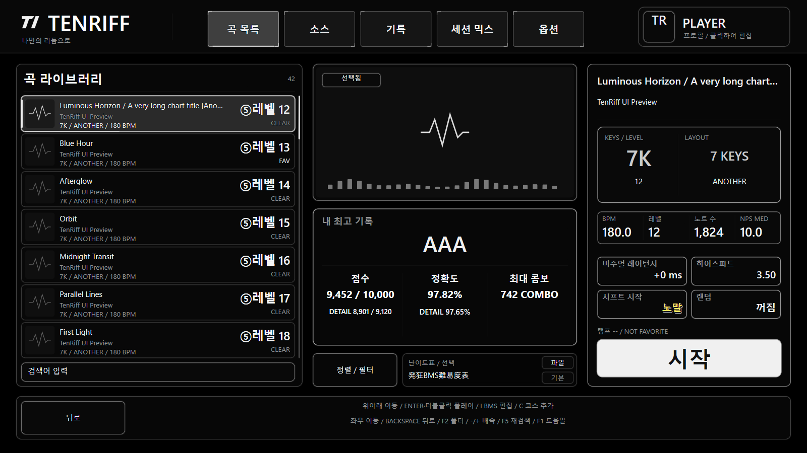

# TenRiff 1.8.1 — black menus, contextual help and web records

2026-10-03. This release updates the menu presentation and settings workflow from 1.8.0.

## Changes and rationale

- Use black surfaces, neutral borders and white selection indicators in Options, the title screen and Song Select. Replace pastel placeholder jackets and decorative center shapes with simple functional graphics. Actual chart images and explicit custom-skin overrides retain their authored appearance.
- Add 18 original geometric icons with matching editable SVG, compiled vector and portable PNG versions. TenRiff Studio connects the PNG assets through the existing skin manifest. Icon stroke width increases from 1.6 to 2.16; this is a geometric change, not a measured 35% readability claim.
- Explain the selected option's effect and controls in Korean, English and Japanese. Stable setting IDs keep help matched to the action when rows move.
- Use Left/Right in Key Test to select 4K–10K, 12K, 14K or 16K. The ends clamp, and testing does not change saved bindings or the active play mode.
- Use Tab in Records to cycle local history, GPT Sites web rankings and the existing verified server. Left/Right selects the web condition group and F5 refreshes it. The existing background worker handles bounded public GET requests without account credentials; web submissions remain distinct from server replay verification.
- Fix a native skin crash caused by releasing live text formats while building the font-role table. Preserve fractional skin metrics and keep image preloading within the bounded bitmap cache.

See [design and controls](menu-studio-1.8.1.ko.md) and the [leaderboard guide](sites-leaderboard.md).

## Completed local validation

- MSVC x64 Release client and test build; CTest 3/3, 915 internal cases, no integration exclusions.
- Skin editor 27/27; 18 vector assets, 18 generated PNGs and native catalog consistency checks.
- 17 production D3D11/D2D fixture captures, including Korean/Japanese/English menus and 1366×768, 1600×900 and 1920×1080 layouts. The production hit resolver checks 281 regions. These are geometry checks, not OS input injection.
- The production WinHTTP client and MenuApp worker read a public song's condition group and two leaderboard entries without credentials or score submission.
- Local candidate ZIP CRC, extracted-file hashes, clean defaults and privacy signature checks pass.

Before publication, the release workflow independently builds and tests the extracted source, checks PR/main AddressSanitizer and OpenVINO CI, matches the final source ZIP to the merged commit, and downloads all three uploaded assets to verify SHA-256. Results belong in the GitHub release notes and external release evidence; this source document does not assume those future checks passed.

## Limits and package boundary

Physical keyboard rollover, real OS mouse/key dispatch, multi-PC play and long gameplay sessions remain unverified. The Sites API returns up to 100 recent condition groups and the top 100 players per group. One supplemental Japanese Key Test footer line falls back to English; its main selected help and arrow instructions are Japanese. Optional external 10k-calc comparison is unavailable in the public source archive.

The release ships the client ZIP, source ZIP and SHA-256 checksums. Accounts, connection secrets, profiles, song libraries, replay/result exports, logs and diagnostic evidence stay outside the public payload. Documentation captures use synthetic fixtures. Leaderboard server source is not included. Existing title artwork remains bundled as an optional asset with its original provenance metadata.

Extract the client into a new folder and run `launch_win.bat`. Keep the previous installation while checking the new version with your own library.
