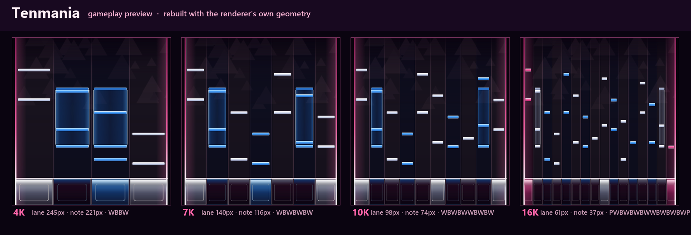

# Tenmania

osu!mania 감각의 **로비 + 인게임 통합** TenRiff 스킨. 1K~16K 전 키 모드를 지원한다.

[`Tencircle`](../Tencircle)이 osu! 메뉴를 가져왔다면 이쪽은 스테이지를 가져온다.
검정에 가까운 자두색 플레이필드, 핑크 스테이지 레일, 그리고 흰색·파랑·핑크로 나뉘는
컬럼 색이 전부다.



## 컬럼 색 규칙

| 색 | 파일 이름 | 쓰이는 자리 |
|---|---|---|
| 흰색 | `*-white.png` | 홀수 번째 건반 |
| 파랑 | `*-blue.png` | 짝수 번째 건반 |
| 핑크 | `*-pink.png` | 스크래치, 또는 스크래치가 없는 홀수 키 모드의 정중앙 |

흰색과 파랑이 번갈아 오는 건 IIDX 피아노 배열 그대로다. BMS 계열 입력을 쓰는
엔진이라 키 모드도 그 관습을 따라간다.

| 모드 | 배열 | 근거 |
|---|---|---|
| 4K | `W B B W` | osu!mania 4K 관습(바깥 흰색, 안쪽 파랑) |
| 5K | `W B W B W` | BMS 5keys |
| 6K | `P` + 5keys | 5keys + 왼쪽 스크래치 |
| 7K | `W B W B W B W` | BMS 7keys |
| 8K | `P` + 7keys | 7keys + 왼쪽 스크래치 |
| 9K | 정중앙 핑크 | PMS 9버튼 |
| 10K / 14K | 5keys×2 / 7keys×2 | DP |
| 12K / 16K | `P` + 필드×2 + `P` | DP, 양쪽 바깥이 스크래치 |
| 그 밖(1K·2K·3K·11K·13K·15K) | 교대 배열 + 정중앙 핑크 | 변환 결과가 어떤 키 수로 나오든 경고 없이 받는다 |

`gameplay.lane_map`으로 이름을 바꾸면 배열도 바뀐다. 예를 들어 스크래치를 오른쪽에
두고 싶으면 해당 모드의 `lane_map`에서 `"pink"`를 끝으로 옮기면 되고, 파일은 그대로다.

```json
"8k": {
  "lane_map": ["white", "blue", "white", "blue", "white", "blue", "white", "pink"]
}
```

## 파일 구성

에셋 경로는 전부 `{lane}` 패턴 하나로 끝난다. 레인 수만큼 배열을 늘어놓을 필요가 없다.

```json
"note": "gameplay/note-{lane}.png",
"key_idle": "gameplay/key-idle-{lane}.png"
```

- `lobby/background.png` — 삼각형 필드 위로 오른쪽 여백에서 스테이지가 떠오르는 배경.
  메뉴 패널이 놓이는 가운데는 일부러 비워 뒀다.
- `lobby/logo.png` — 미니 스테이지 마크 + `TenRiff!` 워드마크.
- `gameplay/background.png` — 가운데 980px(플레이필드 자리)는 거의 검정, 장식은 여백에만.
- `gameplay/gear.png` — 플레이필드 전체를 덮는 스테이지 프레임. 레인 경계선을 굽지
  않았으므로 키 수가 바뀌어도 어긋나지 않는다.
- `gameplay/note-*`, `hold-head-*`, `hold-body-*`, `hold-tail-*` — 노트와 롱노트.
- `gameplay/key-idle-*`, `key-pressed-*` — `full_lane_receptors` 방식의 스테이지 바닥.
  누르는 순간 컬럼 전체가 그 색으로 차오른다.

## 늘어나도 안 깨지는 이유

렌더러는 이미지 슬롯을 목적지 사각형에 그대로 늘려 그린다. 그래서 에셋을 방향별로
단순하게 그렸다.

- 노트·홀드 머리/꼬리 → **세로 방향으로만** 변화. 4K의 221px 폭이든 16K의 37px 폭이든
  같은 그림이다.
- 홀드 몸통 → **가로 방향으로만** 변화. 롱노트 길이가 얼마든 이음매가 없다.
- 리셉터 → 가로 줄무늬. `full_lane_receptors`가 주는 상자는 4K에서 가로세로비 1.4,
  16K에서 0.36까지 흔들린다.
- `gameplay/gear.png` → 렌더러의 기준 플레이필드 사각형과 같은 `980x1080`으로 그려서
  스테이지 레일이 1:1로 떨어진다.

## 설치

1. 게임에서 `Options > Skins > Import Skin`을 누르고 이 폴더를 고른다.
   (Skins 화면에 폴더를 드래그해도 된다.)
2. `Skin Source`를 `TenRiff`로 바꾼다.
3. `TenRiff Skin` 행에서 `Tenmania`를 고른다.
4. 파일을 고친 뒤에는 `F5`로 다시 읽는다.

## 매니페스트가 고정하는 값

아래 항목은 스킨이 명시했으므로 플레이어의 같은 시각 옵션보다 우선한다. 취향에 맞지
않으면 `skin.json`에서 해당 줄을 지우면 플레이어 설정으로 돌아간다.

| 항목 | 값 | 이유 |
|---|---|---|
| `judgement_line_position` | `0.84` | osu!의 기본 hit position(402/480)과 같은 자리 |
| `full_lane_receptors` | `true` | osu!mania식 스테이지 바닥 |
| `black_playfield` | `true` | 검정 스테이지 |
| `hit_burst_style` | `"ring"` | 히트서클이 퍼지는 링 |
| `key_label_position` | `"off"` | osu!mania에는 키 라벨이 없다 |
| `hold_body_opacity` | `0.6` | 렌더러가 비트맵 몸통에 허용하는 상한값 |
| `note_aspect` | `"stretch"` | 바 노트용. 이 값이 있으면 `Image Aspect` 토글보다 우선한다 |

## Native로 남겨 둔 것

- 판정선, 레인 구분선, 히트 버스트, 키 펄스는 이미지가 아니라 엔진이 그린다.
  색은 `theme.judgement_line`, `theme.lane_divider`, 모드별 `lane_colors`로 맞춰 뒀다.
- `layout`은 건드리지 않았다. 메뉴 배치는 TenRiff 기본값 그대로다.
- 화면별 배경 이미지는 따로 두지 않고 `lobby.screen_opacities`로 화면마다 밝기만 다르게 했다.

## 수정

PNG를 직접 편집하지 말고 `generate.py`를 고친 뒤 다시 돌린다.

```bash
python generate.py
```

미리보기 이미지는 `skin.json`을 읽어 렌더러와 같은 계산식으로 다시 그린다.

```bash
python preview.py
```

자주 건드릴 만한 것:

- 파일 위쪽 팔레트 상수 — `PINK`, `BLUE`, `INK` 등 전체 색조
- `LANES` 딕셔너리 — 컬럼별 밝은색/중간색/어두운색 세 단계
- `note_bar()`의 `stops` — 노트 바의 그라데이션
- `receptor()`의 알파 값 — 스테이지 바닥의 밝기
- `hold_body()`의 가로 그라데이션 — 롱노트 몸통이 얼마나 비어 보이는지

배경이 너무 밝거나 어두우면 이미지를 다시 그리기 전에 `skin.json`의
`background_opacity`(로비 `0.92`, 인게임 `0.78`)부터 조절한다.

## 자산 출처

`lobby/`와 `gameplay/`의 PNG는 전부 이 폴더의 `generate.py`가 Pillow로 직접 그린
오리지널이다. 다른 리듬 게임이나 배포 스킨에서 가져온 이미지는 없다. 폰트는 렌더링
시점에 Windows 기본 폰트(Arial Rounded MT Bold, 없으면 Segoe UI Bold)를 쓰며 로고
PNG에 래스터화되어 들어간다.

## 확인한 것 / 확인하지 않은 것

- `docs/tenriff-skin.schema.json` 스키마 검증 통과.
- 1K~16K 전 모드에 대해 참조 에셋 816개가 모두 존재하는지 스크립트로 확인.
- 4K·7K·10K·16K는 `preview.py`가 렌더러와 같은 좌표 계산으로 그린 목업으로 확인했다.
  **실제 게임 스모크 테스트는 아직이다.** 가져온 뒤 `F5`를 눌러 경고가 없는지,
  16K의 중앙 간격(`lane_center_gap`)에서 레일과 레인이 어긋나지 않는지 확인하면 좋다.
